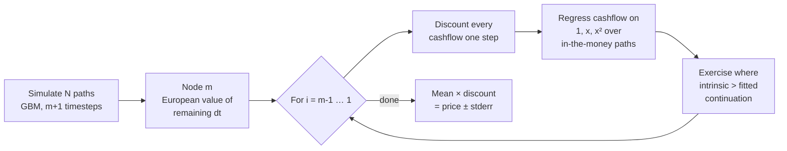
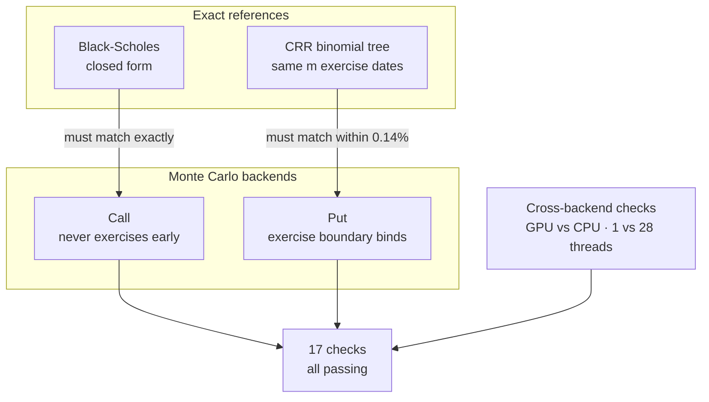

# American Option Pricing Engine

**GPU-accelerated Bermudan option pricing by Longstaff-Schwartz least-squares Monte Carlo, in CUDA and OpenMP.**

Started as a reimplementation of *Cvetanoska & Stojanovski, "Using High Performance
Computing and Monte Carlo Simulation for Pricing American Options"*. The paper's
valuation method turned out to be **systematically wrong** — biased 56% high at 21
exercise dates, and the bias grows without bound. This engine replaces it with
Longstaff-Schwartz, validates the result against two independent references, and
runs it 53× faster than a serial CPU baseline.

| | |
| --- | --- |
| **Exact price** (Black-Scholes, non-dividend call) | `10.450584` |
| **This engine** (QMC, 4M paths) | `10.450566` — error `−1.7e-5` |
| **The paper's method** | `16.34` — error `+5.89` |
| **Speedup** | 53.4× serial · 10.0× 28-thread OpenMP |
| **Tests** | 17 checks, 2 suites, all passing |

---

## The headline result

<picture>
  <source media="(prefers-color-scheme: dark)" srcset="docs/img/bias-dark.png">
  
</picture>

An American **call on a non-dividend-paying stock is worth exactly its European
counterpart** — early exercise is never optimal. That makes Black-Scholes an exact
yardstick, and any gap is bias, not noise.

The paper values each path with `max(intrinsic, discounted continuation)` using
**that path's own realised future**. Every path exercises with hindsight, so the
estimator is biased high and gets worse the more exercise dates you give it.

---

## How it works



Two details make it correct rather than merely plausible:

- **The regression supplies the exercise *decision* only.** Valuation always uses the
  realised cashflow, never the fitted value. Substituting the fit back in
  reintroduces bias.
- **Only in-the-money paths enter the regression.** Out-of-the-money paths carry no
  decision, and including them degrades the fit exactly where the exercise boundary
  lives.

The estimator is *low-biased*: a fitted policy is suboptimal, and a suboptimal
exercise policy under-values. That is the safe direction.

### Time grid

With `dt = T/(m+1)`, path value `S[i]` sits at `i·dt`. The last grid point is at
`T − dt`, not `T`: the `m` exercise opportunities are at `dt, 2dt, …, m·dt`, and the
option still has `dt` of life left after the final one. Node `m` therefore needs no
regression — holding is worth the European value over the remaining step, which is an
exact conditional expectation.

---

## Validation

A call cannot distinguish "LSM works" from "LSM never exercises", because never
exercising *is* the right answer there. So the suite checks both directions:



The tree is restricted to the **same `m` exercise dates** the Monte Carlo grid uses,
so both price the identical Bermudan. Comparing against a fully American tree would
be apples to oranges — continuous exercise is worth strictly more than `m` discrete
dates.

| Check | What it catches | Result |
| --- | --- | ---: |
| American call == European | Any bias; does not shrink with N | err < 0.017 |
| American put vs CRR tree | A wrong exercise boundary | within 0.14% |
| Early-exercise premium > 0 | An exercise rule that never fires | +1.2192 |
| Sobol vs van der Corput | Bit-reversed direction numbers | exact |
| OpenMP 1 thread vs 28 | A wrong reduction in the regression | 2.8e-13 |
| GPU QMC vs host QMC | Device Sobol/bridge/LSM drift | < 1e-6 |
| fp32 vs fp64 paths | Precision loss that actually matters | 8e-6 |

---

## Performance

<picture>
  <source media="(prefers-color-scheme: dark)" srcset="docs/img/speedup-dark.png">
  
</picture>

<picture>
  <source media="(prefers-color-scheme: dark)" srcset="docs/img/runtime-dark.png">
  
</picture>

Intel i7-14700HX (20C/28T) · RTX 5060 Laptop · CUDA 12.4 · `S₀=X=100, T=1, r=5%, σ=20%, m=20`

| Backend | Price @ 4×10⁶ | Error | Time | vs serial |
| --- | ---: | ---: | ---: | ---: |
| Serial (LCG) | 10.452417 | `+0.001834` | 3199.8 ms | 1.00× |
| OpenMP, 28 threads | 10.452417 | `+0.001834` | 596.7 ms | 5.36× |
| OpenMP QMC | 10.450566 | `−0.000017` | 1163.0 ms | 2.75× |
| CUDA, fp64 paths | 10.452417 | `+0.001834` | 160.6 ms | 19.9× |
| **CUDA, fp32 paths** | 10.452409 | `+0.001825` | **59.9 ms** | **53.4×** |
| CUDA QMC | 10.450566 | `−0.000017` | 178.9 ms | 17.9× |

### Convergence

<picture>
  <source media="(prefers-color-scheme: dark)" srcset="docs/img/convergence-dark.png">
  
</picture>

QMC reaches three-decimal accuracy at 100,000 paths where the pseudo-random backends
need 1,000,000. The LCG curve ticking *up* between 10⁶ and 4×10⁶ is not a bug —
Monte Carlo error is a random walk around zero, not a monotone decline.

---

## Profiling: two wrong guesses, then the real bottleneck

The first correct version ran only 19× serial, which is poor for an embarrassingly
parallel problem. Rather than guess, `./build/profile_gpu` splits device time into
path generation and the LSM backward pass. It killed both obvious hypotheses:

| Hypothesis | Measured reality |
| --- | --- |
| The 19 host round trips for the regression solve dominate | Under 1 ms of a 56 ms pass |
| Uncoalesced reads dominate (paths were point-major, threads 168 B apart) | Time-major layout changed runtime **< 2%** |
| — | **FP64 arithmetic in path generation: 63%** |

Path generation is transcendental-heavy — one `exp` per step plus two `log`s in
Moro's tail branch — on a card that runs doubles at 1/64 the FP32 rate. Moving path
storage and generation to fp32, **while keeping the regression accumulation in
double**, gives 2.7× for a price change of `8e-6` against a Monte Carlo standard
error of `7.1e-3` — a thousandth of the noise it sits inside.

> The time-major layout was kept regardless. It is the correct layout and costs
> nothing; it simply was not the bottleneck.

### A bug the fp32 experiment surfaced

At four million paths the single-precision run returned `inf`.
`__uint2float_rn(0xFFFFFFFF)` rounds up to exactly 2³², so the float LCG can emit
exactly `1.0`, and Moro then evaluates `log(−log(0))`. **The same hole existed in the
double path all along** — LCG state `0` gives `u = 0` — merely rare enough never to
have fired. Both are now clamped inside Φ⁻¹ itself, where the function is genuinely
undefined, rather than at the four call sites. Two regression tests cover it.

---

## Build

```bash
cmake -S . -B build -DCMAKE_BUILD_TYPE=Release
cmake --build build -j
ctest --test-dir build --output-on-failure
```

CUDA targets are skipped automatically if no toolkit is present; `-DUSE_CUDA=OFF`
skips them deliberately.

> **Host compiler:** nvcc pins its own supported GCC (CUDA 12.4 tops out at GCC 13).
> If your default `g++` is newer, configure with `-DCMAKE_CXX_COMPILER=g++-13`, or
> linking `run_cuda_tests` fails on an undefined `__cxa_call_terminate`. CMake warns
> when it detects the mismatch.

> **CUDA arch:** defaults to `sm_80` with PTX emitted alongside, so newer GPUs JIT.
> Override with `-DCMAKE_CUDA_ARCHITECTURES=89` (Ada), `90` (Hopper), etc.

## Run

```bash
./build/american_serial                 # any of the five backends
./build/american_cuda   call fp32       # [call|put] [fp64|fp32]
./build/american_qmc_cuda put
./build/profile_gpu                     # setup / pathgen / LSM breakdown
./build/validate                        # CPU validation suite
```

## Documentation

| Document | For |
| --- | --- |
| **[`docs/REPORT.md`](docs/REPORT.md)** | The full write-up — problem, method, correction, validation, profiling, limitations. Start here. |
| [`docs/ARCHITECTURE.md`](docs/ARCHITECTURE.md) | Contributors: module map, design decisions and why, numerical gotchas |
| [`docs/benchmark-results.html`](docs/benchmark-results.html) | Interactive results dashboard, self-contained, open from disk |
| [`docs/results/`](docs/results/) | Raw harness output behind every figure |

Charts regenerate with `python3 docs/make_charts.py`.

---

## Layout

```
src/core/     hd_math.hpp     option math compiled for host AND device
              lsm.{hpp,cpp}   Longstaff-Schwartz regression + backward pass
              paths.*         path simulation (shared by serial and OpenMP)
              binomial.*      CRR tree — independent oracle for the tests
              sobol, halton, brownian_bridge, scramble, moro, black_scholes
              backward_induction.hpp   the paper's naive recursion, kept only
                                       so the bias comparison can be made
src/cuda/     path-generation kernels, lsm_gpu.cu (device backward pass),
              cuda_check.h (CUDA_TRY error macros)
src/openmp/   OpenMP backends, standard and QMC
src/benchmark/ benchmark drivers and the GPU profiler
tests/        validate.cpp (no GPU needed) · test_cuda.cpp (GoogleTest)
```

## Known limitations

These are open, not hidden:

- **Pseudo-random streams are not independent.** Path seeds are
  `(path_id + 1) × 1234567` on a 2³² LCG, so neighbouring paths walk correlated
  positions on the same lattice. A counter-based generator (cuRAND Philox) is the fix.
- **No error bar on the QMC result.** `sd/√N` assumes independent draws and Sobol is
  deterministic; at 4×10⁶ the QMC backends *report* a standard error of `0.0071` while
  the actual error is `0.000017`. A real bound needs randomised QMC — average over
  several independent digital shifts and take the sd of the means.
- **LSM is low-biased**, so a true confidence interval needs a paired upper bound
  (the Andersen-Broadie dual).
- **Memory bounds the problem.** The regression is cross-sectional, so the whole path
  set must be resident: `N × (m+1)` values, 336 MB at N=4×10⁶ in fp64.
- **The GPU is handicapped here.** CUDA 12.4 has no native sm_120 target, so kernels
  arrive by PTX JIT from sm_80.

## References

Glasserman, *Monte Carlo Methods in Financial Engineering* (Springer, 2004) ·
Longstaff & Schwartz, "Valuing American Options by Simulation: A Simple
Least-Squares Approach", *RFS* 14(1), 2001 · Joe & Kuo, "Constructing Sobol
sequences with better two-dimensional projections", *SIAM J. Sci. Comput.* 30, 2008 ·
Cvetanoska & Stojanovski, "Using High Performance Computing and Monte Carlo
Simulation for Pricing American Options".
