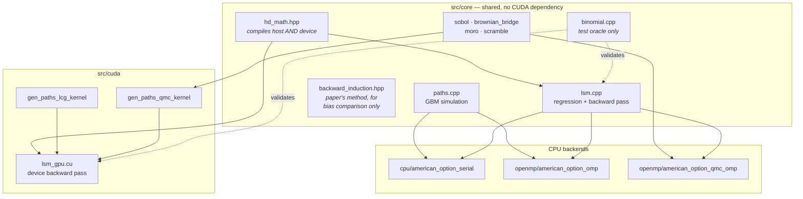

# Architecture and design notes

For people working on this code. The README covers what it does and how fast; this
covers how it is put together and, more usefully, **why** — including the decisions
that look odd until you know what they are defending against.

---

## Module map



The rule that keeps this honest: **there is exactly one implementation of the
algorithm per side.** `lsm.cpp` serves serial, OpenMP and QMC-OpenMP alike;
`lsm_gpu.cu` serves both GPU backends. The option math they share
(`mc_bs_call`, `mc_intrinsic`, …) lives in `hd_math.hpp` and compiles for host and
device from the same source. Before this, the backward recursion existed in five
copies and they had silently drifted apart.

---

## The five backends

| Backend | Randomness | Parallelism | File |
| --- | --- | --- | --- |
| Serial | LCG | none | `cpu/american_option_serial.cpp` |
| OpenMP | LCG | threads | `openmp/american_option_omp.cpp` |
| OpenMP QMC | Sobol + bridge | threads | `openmp/american_option_qmc_omp.cpp` |
| CUDA | LCG | GPU | `cuda/american_option.cu` |
| CUDA QMC | Sobol + bridge | GPU | `cuda/american_option_qmc.cu` |

**Serial and OpenMP are the same source.** The loops in `paths.cpp` and `lsm.cpp`
carry `#pragma omp` directives; the serial target is simply built without
`-fopenmp`, so the compiler ignores them. Adding a thread-parallel backend cost
zero duplicated algorithm.

One consequence worth knowing: inside the `validate` binary, which links OpenMP for
the other backends, the "serial" entry point is *also* compiled with `-fopenmp`.
Comparing serial against OpenMP there proves nothing, which is why that test instead
runs the parallel backend at **1 thread versus 28** — a thread-count-dependent price
means the regression reduction is wrong.

---

## Decisions that look odd

### Paths are stored point-major on the host, time-major on the device

Host: `S[n*(m+1) + i]`. Device: `S[i*N + n]`.

Both are correct for their access pattern. Every GPU kernel sweeps all paths at one
fixed timestep, so time-major makes consecutive threads read consecutive addresses.

**Honesty note:** this was changed expecting a large win and delivered under 2%. It
was kept because it is the right layout and costs nothing, not because it was the
optimisation that mattered. See the profiling section in the README.

### The regression accumulates in double even when paths are float

`OptionParams::precision` selects fp32 or fp64 for path *storage and generation*.
The normal equations are always double. AᵀA's entries scale with N, and summing four
million terms in float would lose far more precision than the paths ever could. This
is not a hedge — it is the reason fp32 paths are safe at all.

### Block partials are summed on the host, not with `atomicAdd`

`atomicAdd` on doubles makes the result depend on block completion order, so two runs
of the same pricer could disagree in the last digits — and a knife-edge path could
flip its exercise decision. Blocks are reduced on device, copied back, and summed in
index order. Reproducibility beats the microseconds.

### `mc_max` and friends instead of `std::max`

`hd_math.hpp` compiles under `nvcc` for device code, where the `std::` overloads are
not reliably available. Unqualified `sqrt`/`log`/`exp`/`erfc` resolve to the double
overloads on both sides.

### The paper's broken recursion is still in the tree

`backward_induction.hpp` and `price_american_call_serial_naive()` exist solely so
`validate` can print the bias table. Do not use them to price anything.

---

## Adding a backend

1. Write a path generator producing `N × (m+1)` values in the layout your side uses.
2. Call `lsm_price_from_paths` (host) or `lsm_price_device` (device). Do not write a
   new backward pass.
3. Declare the entry point in `src/core/backends.hpp` — not as a hand-written
   `extern` in each caller. That header exists because the declarations used to be
   duplicated in four files and a signature change could silently become an ODR
   violation the linker cannot see.
4. Add the target to `CMakeLists.txt` via `add_backend_benchmark`.
5. Add a cross-backend agreement test. A new backend that agrees with nothing is not
   validated.

## Adding a test

`tests/validate.cpp` reports rather than asserts, so one failure does not hide the
rest, and returns non-zero if any hard check fails. Use `check()` for real checks and
`check_known_broken()` for a check that documents a known gap — it prints `[XFAIL]`
with the blocker named and does not fail the build, and it tells you to promote it
once it starts passing.

**Write the test against an oracle, not against the current output.** Every check in
this suite compares to something derived independently: a closed form, a binomial
tree, a different backend, or a different thread count. The suite this replaced
asserted `price > 0 && !isnan(price)`, which a 43%-wrong pricer passes happily.

---

## Numerical gotchas

- **Φ⁻¹ is undefined at 0 and 1**, and Moro's tail branch evaluates `log(−log(u))`.
  The LCG reaches state `0`; the float LCG can emit exactly `1.0` because
  `__uint2float_rn(0xFFFFFFFF)` rounds up to 2³². Both are clamped inside
  `moro_inv_cnd`. Do not remove those clamps.
- **`sd/√N` is not a valid error bar for QMC.** Sobol points are deterministic and
  correlated. The number the QMC backends print is what the same payoffs would have
  scored under pseudo-random sampling — an upper bound, usually wild.
- **LSM is low-biased.** Prices converge from *below*. A put coming in slightly under
  the binomial reference is expected; coming in above it is a red flag.
- **`m` is bounded.** 63 for the LCG kernel's per-thread buffer, 21 for the QMC
  kernel's Sobol dimension table. Both launchers reject out-of-range `m` rather than
  corrupting memory — keep it that way.
- **Monte Carlo error is a random walk**, not a monotone decline. A larger N giving a
  slightly worse error is not a bug.

## Reproducing the numbers

```bash
cmake -S . -B build -DCMAKE_BUILD_TYPE=Release -DCMAKE_CXX_COMPILER=g++-13
cmake --build build -j
ctest --test-dir build --output-on-failure

for b in american_serial american_omp american_qmc_omp; do
  ./build/$b > docs/results/$b.call.txt
done
for b in american_cuda american_qmc_cuda; do
  ./build/$b call fp64 > docs/results/$b.call.fp64.txt
  ./build/$b call fp32 > docs/results/$b.call.fp32.txt
done
./build/profile_gpu > docs/results/profile_gpu.txt
python3 docs/make_charts.py
```

Numbers in the README and `benchmark-results.html` are transcribed from
`docs/results/`. If you re-run on different hardware, update both — or the charts
will quietly describe a machine nobody has.
