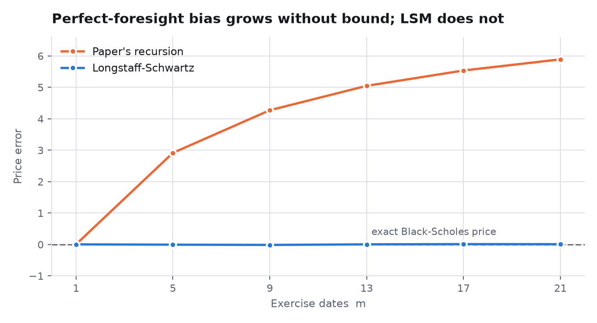
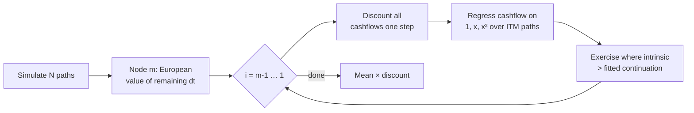
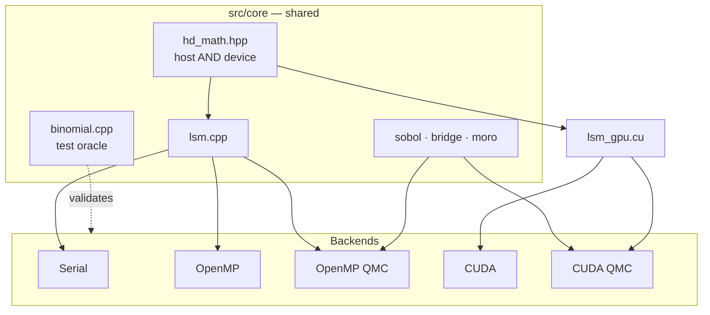
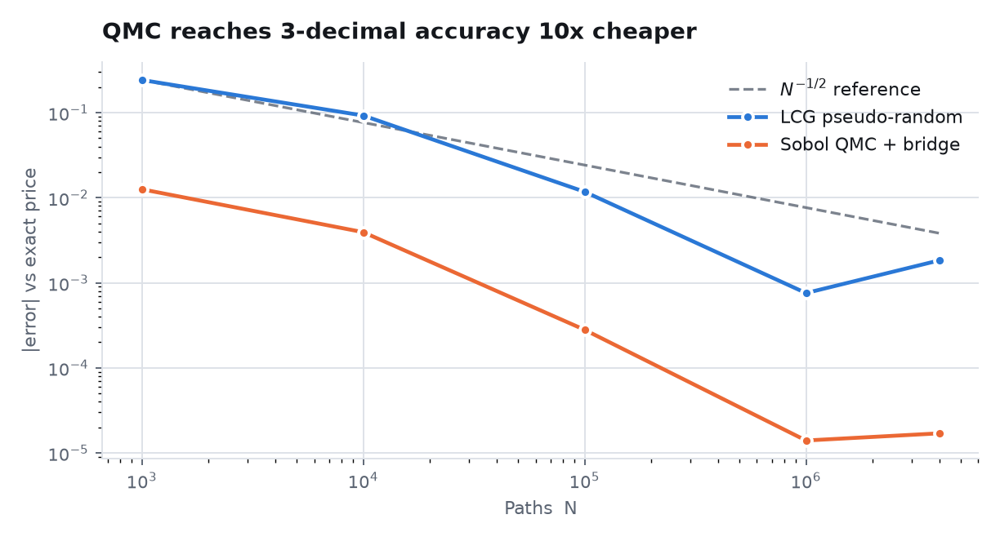
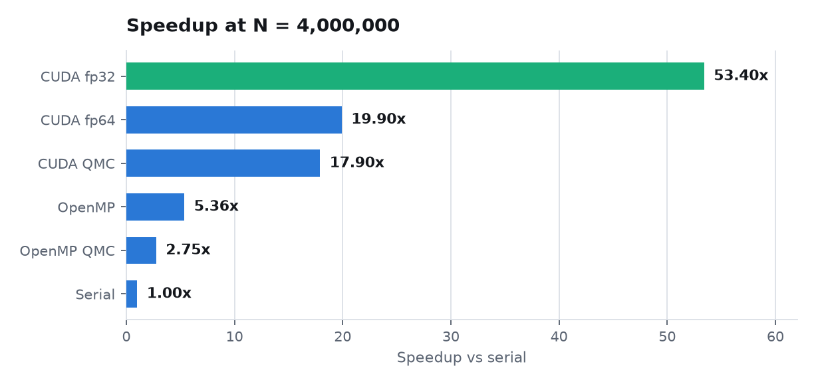
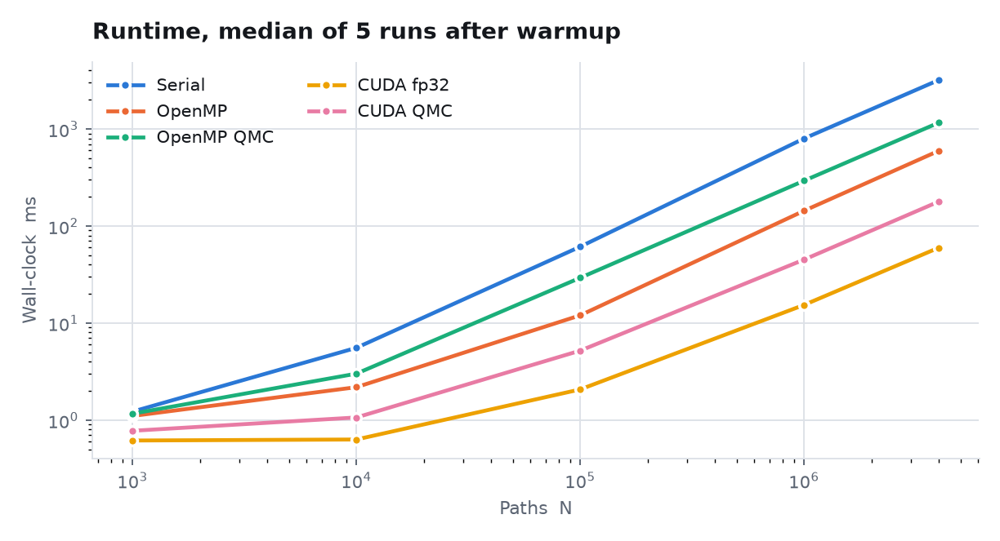
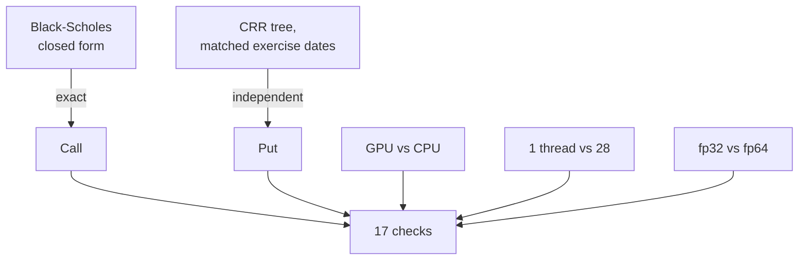

# Pricing American Options by Least-Squares Monte Carlo on GPUs

**A reproduction study, a correction, and a performance analysis**

Jayant Batra · Thapar Institute of Engineering & Technology · July 2026

---

## Abstract

We set out to reproduce Cvetanoska & Stojanovski's GPU-accelerated American option
pricer and found that its valuation method is **systematically incorrect**. The
paper values each simulated path using that path's own realised future, which
amounts to exercising with perfect foresight. The resulting estimator is biased
upward without bound in the number of exercise dates: at 21 dates it overprices a
benchmark contract by **56%**.

We replace the method with Longstaff-Schwartz least-squares Monte Carlo, and
validate the replacement against two references that share no code with the
simulation — the Black-Scholes closed form and a Cox-Ross-Rubinstein binomial tree.
The corrected engine prices the benchmark call to within **1.7 × 10⁻⁵** of exact and
an American put to within **0.14%** of the tree across four strike and volatility
regimes.

We then profile and optimise five backends. Two intuitive performance hypotheses —
host synchronisation overhead, and uncoalesced memory access — are both refuted by
measurement; the actual bottleneck is double-precision transcendental arithmetic in
path generation, at 63% of device time. Addressing it yields **53.4× over a serial
CPU baseline** and **10.0× over 28-thread OpenMP** at four million paths. The
optimisation experiment additionally exposed a latent floating-point overflow
present in the original code.

---

## 1. Introduction

An American option may be exercised at any time before maturity. Unlike its European
counterpart it has no closed-form price, because the holder's optimal exercise
policy must be determined jointly with the value. In practice the contract is
discretised into a **Bermudan** option exercisable at `m` fixed dates, and priced by
backward induction.

Monte Carlo simulation is the natural tool when the state space is large, but it
runs backwards awkwardly: at each exercise date the holder must compare the payoff
from exercising now against the **conditional expectation** of continuing, and a
forward simulation does not supply that expectation. How one estimates it is the
entire difficulty of the problem, and it is precisely where the reproduced paper
goes wrong.

### 1.1 Objectives

1. Reproduce the reference implementation across serial, OpenMP and CUDA backends.
2. Establish whether the prices produced are correct, against independent references.
3. Extend the work with quasi-Monte Carlo variance reduction.
4. Characterise and optimise GPU performance on evidence rather than intuition.

### 1.2 Benchmark contract

Unless stated otherwise all results use:

| Parameter | Value |
| --- | --- |
| Spot `S₀` | 100 |
| Strike `X` | 100 |
| Maturity `T` | 1 year |
| Risk-free rate `r` | 5% |
| Volatility `σ` | 20% |
| Exercise dates `m` | 20 |

The underlying follows geometric Brownian motion under the risk-neutral measure.

---

## 2. Discretisation

With `dt = T/(m+1)`, path value `S[i]` sits at time `i·dt` for `i = 0 … m`. Note
that the final grid point lies at `T − dt`, not at `T`: the `m` exercise
opportunities are at `dt, 2dt, …, m·dt`, and the option retains `dt` of life after
the last one. The value of *holding* at node `m` is therefore the European value
over the remaining step — an exact conditional expectation requiring no estimation.

Paths evolve as

```
S[i] = S[i-1] · exp( (r − σ²/2)·dt + σ·√dt · z )
```

with `z` a standard normal shock obtained by applying Moro's inverse cumulative
normal to a uniform variate.

---

## 3. The reference method and why it fails

The reproduced paper values each path independently:

```
c ← European value at the final node
for i = m−1 down to 1:
    c ← max( S[i] − X ,  c · e^(−r·dt) )
```

The quantity `c` on the right-hand side is **that path's own realised future value**.
The holder is therefore assumed to know, at time `i·dt`, exactly what the underlying
will do afterwards. No such information exists at that time.

This is the classic *perfect-foresight* (or high-biased) estimator. Because
`E[max(X, Y)] ≥ max(E[X], E[Y])`, substituting a realised path value for a
conditional expectation inside a maximum can only overstate the option. Every
additional exercise date supplies another opportunity to exploit hindsight, so the
bias **accumulates in `m` rather than converging**.

### 3.1 Quantifying the bias

A theorem gives us an exact yardstick: **early exercise of an American call on a
non-dividend-paying stock is never optimal**, so such a call is worth precisely its
European counterpart. Black-Scholes therefore supplies the true price, 10.450584,
and any deviation is bias rather than sampling noise.

<picture>
  <source media="(prefers-color-scheme: dark)" srcset="img/bias-dark.png">
  
</picture>

| `m` | Reference method | Error | LSM | Error |
| ---: | ---: | ---: | ---: | ---: |
| 1 | 10.4518 | +0.0012 | 10.4518 | +0.0012 |
| 5 | 13.3630 | +2.9124 | 10.4426 | −0.0080 |
| 9 | 14.7195 | +4.2690 | 10.4342 | −0.0164 |
| 13 | 15.4959 | +5.0454 | 10.4525 | +0.0019 |
| 17 | 15.9839 | +5.5333 | 10.4594 | +0.0088 |
| 21 | 16.3388 | +5.8882 | 10.4573 | +0.0067 |

At `m = 1` there is effectively a single decision and both methods recover the exact
price. Beyond that the reference method diverges monotonically, reaching **+56%**.

### 3.2 Defects found in the reference implementation

Correcting the method also required correcting the code. Four further defects were
identified, none of which the original test suite could detect — it asserted only
that the price was positive and not NaN, a condition the 43%-wrong pricer satisfied.

| Defect | Effect |
| --- | --- |
| Discount applied per step *and* again at the end | ≈4.5% under-price at `m = 10`, partially masking the foresight bias |
| Backward pass seeded from `S[m−1]`, leaving `S[m]` unused | Off-by-one at the terminal node |
| Sobol direction numbers indexed `V[31−k]` instead of `V[k]` | Bit-reversed, degenerate sequence; dimension 0 pinned near zero. The GPU generator indexed correctly, so CPU and GPU silently computed different things |
| QMC backend read a point-major array as dimension-major | Coordinates shuffled between paths |

A fifth defect, a floating-point overflow, was found later during optimisation and
is described in §7.3.

---

## 4. Longstaff-Schwartz least-squares Monte Carlo

LSM estimates the continuation value **cross-sectionally**. At each exercise date it
regresses the realised discounted future cashflow on functions of the current spot,
across all paths that are in the money, and uses the fitted value as the
continuation estimate.



Two properties of the implementation are essential rather than incidental:

**The regression supplies the exercise decision only.** Valuation always uses the
realised cashflow. Substituting the fitted value back into the recursion
reintroduces exactly the estimation bias LSM exists to remove.

**Only in-the-money paths enter the regression.** Out-of-the-money paths carry no
exercise decision, and including them degrades the fit precisely in the region where
the exercise boundary lies.

We use the basis `{1, x, x²}` with `x = S/X`; normalising by the strike keeps the
normal equations well conditioned across strike scales.

### 4.1 Direction of bias

The fitted exercise policy is necessarily suboptimal, and any suboptimal policy
under-values the option. LSM is therefore **low-biased**, converging from below as
the path count and basis richness increase. This is the safe direction for a pricer,
and it is visible in the results: put prices sit slightly beneath the tree
reference, never above it.

---

## 5. Variance reduction

Two quasi-Monte Carlo backends replace pseudo-random sampling with a Sobol
low-discrepancy sequence, combined with a **Brownian bridge** construction.

The bridge fills the Wiener path in order of decreasing variance — endpoint first,
then midpoints — so that the leading Sobol dimensions, which are the best
distributed, carry the most variance. This concentrates the effective dimension of
the problem and is what allows QMC to outperform the `O(N^{-1/2})` pseudo-random
rate.

A random digital shift is applied to the sequence, both to avoid the degenerate
all-zero first point and to allow randomisation in future work (§9).

---

## 6. Implementation

Five backends share a single implementation of the algorithm per side.



| Backend | Sampling | Parallelism |
| --- | --- | --- |
| Serial | LCG | — |
| OpenMP | LCG | threads |
| OpenMP QMC | Sobol + bridge | threads |
| CUDA | LCG | GPU |
| CUDA QMC | Sobol + bridge | GPU |

The serial and OpenMP backends are compiled from the same source; the OpenMP
pragmas are simply ignored when built without `-fopenmp`. The option math shared by
host and device (`mc_bs_call`, `mc_intrinsic`, …) is written once in `hd_math.hpp`
and compiled for both. Before this consolidation the backward recursion existed in
five copies which had silently diverged.

### 6.1 Memory

LSM's regression is cross-sectional, so the entire path set must be resident:
`N × (m+1)` values, or 336 MB at four million paths in double precision. The
reference method could consume one path at a time; LSM cannot. This is the binding
constraint on problem size.

### 6.2 Determinism

Block-level partial sums are copied to the host and summed in block order rather
than accumulated with `atomicAdd`. Atomic double addition makes the result depend on
block completion order, which would allow two runs of the same pricer to disagree —
and a path sitting on the exercise boundary to flip its decision between runs.

---

## 7. Results

### 7.1 Correctness

Prices were validated against two independent references.

**Against Black-Scholes** (exact for the non-dividend call):

| N | LCG error | QMC error |
| ---: | ---: | ---: |
| 1,000 | +2.4 × 10⁻¹ | −1.3 × 10⁻² |
| 10,000 | +9.2 × 10⁻² | −3.9 × 10⁻³ |
| 100,000 | +1.2 × 10⁻² | −2.8 × 10⁻⁴ |
| 1,000,000 | +7.6 × 10⁻⁴ | +1.4 × 10⁻⁵ |
| 4,000,000 | +1.8 × 10⁻³ | **−1.7 × 10⁻⁵** |

<picture>
  <source media="(prefers-color-scheme: dark)" srcset="img/convergence-dark.png">
  
</picture>

QMC attains three-decimal accuracy at 100,000 paths where pseudo-random sampling
requires 1,000,000 — roughly an order of magnitude less work. The pseudo-random
error rising slightly between 10⁶ and 4×10⁶ is not a defect: Monte Carlo error is a
random walk about zero, not a monotone decline.

**Against a binomial tree.** The call test above cannot distinguish a working
exercise rule from one that never fires, since never exercising is correct for that
contract. A put is the discriminating case: early exercise binds, no closed form
exists, and a Cox-Ross-Rubinstein tree provides an independent reference. The tree
is restricted to the **same `m` exercise dates** as the Monte Carlo grid, so both
price the identical Bermudan; comparing against a continuously-exercisable American
tree would be invalid.

| Case | LSM | Tree | Error | Relative |
| --- | ---: | ---: | ---: | ---: |
| At the money, σ=20% | 6.0611 | 6.0626 | −0.0016 | −0.03% |
| In the money, S₀=90 | 11.4334 | 11.4495 | −0.0162 | −0.14% |
| Out of the money, S₀=110 | 2.9690 | 2.9710 | −0.0020 | −0.07% |
| High volatility, σ=40% | 13.6481 | 13.6356 | +0.0126 | +0.09% |

The in-the-money put also carries a **+1.2192** early-exercise premium over its
European counterpart. That premium would be identically zero if the exercise rule
never fired, so it guards against a regression that silently disables exercise.

### 7.2 Performance

Measured on an Intel i7-14700HX (20 cores / 28 threads) and an NVIDIA RTX 5060
Laptop under CUDA 12.4, median of five runs after a warmup.

<picture>
  <source media="(prefers-color-scheme: dark)" srcset="img/speedup-dark.png">
  
</picture>

| Backend | Price @ 4×10⁶ | Time | vs serial |
| --- | ---: | ---: | ---: |
| Serial | 10.452417 | 3199.8 ms | 1.00× |
| OpenMP, 28 threads | 10.452417 | 596.7 ms | 5.36× |
| OpenMP QMC | 10.450566 | 1163.0 ms | 2.75× |
| CUDA, fp64 paths | 10.452417 | 160.6 ms | 19.9× |
| **CUDA, fp32 paths** | 10.452409 | **59.9 ms** | **53.4×** |
| CUDA QMC | 10.450566 | 178.9 ms | 17.9× |

The GPU advantage is not an artifact of the largest problem size: at one million
paths the same configuration achieves 51.8× over serial and 9.3× over OpenMP.

<picture>
  <source media="(prefers-color-scheme: dark)" srcset="img/runtime-dark.png">
  
</picture>

### 7.3 Profiling

The first correct implementation achieved only 19× over serial, which is poor for an
embarrassingly parallel workload. Rather than optimise on intuition, the launcher
was instrumented to separate path generation from the backward pass. **Two plausible
hypotheses were refuted by measurement:**

| Hypothesis | Measured |
| --- | --- |
| The 19 host synchronisations for the per-date regression solve dominate | Under 1 ms of a 56 ms pass |
| Uncoalesced access dominates — paths were point-major, placing consecutive threads 168 bytes apart | Converting to time-major changed runtime by **< 2%** |
| — | **FP64 arithmetic in path generation: 63%** |

Path generation is transcendental-heavy: one `exp` per timestep plus two `log`
evaluations in Moro's tail branch. The RTX 5060 executes double precision at 1/64 of
its single-precision rate, making these operations dominant.

Path storage and generation were therefore templated on element type, with **the
regression accumulation kept in double precision** — the entries of `AᵀA` scale with
`N`, and summing four million terms in single precision would lose far more accuracy
than the paths themselves ever could. Both instantiations are compiled into the same
binary so that a single run prices the contract both ways and reports the difference
rather than asserting it is negligible:

| Backend | fp64 price | fp32 price | Difference | MC std. error |
| --- | ---: | ---: | ---: | ---: |
| CUDA LCG | 10.452417 | 10.452409 | 8 × 10⁻⁶ | 7.1 × 10⁻³ |
| CUDA QMC | 10.450566 | 10.450566 | 0 | 7.1 × 10⁻³ |

The price moves by roughly one thousandth of the statistical noise it sits inside.
The QMC backend gains nothing by design: its Sobol points and Brownian bridge remain
in double precision, since the low-discrepancy structure is the entire reason that
backend exists.

**A latent bug surfaced by this experiment.** At four million paths the
single-precision run returned `inf`. `__uint2float_rn(0xFFFFFFFF)` rounds up to
exactly 2³², so the single-precision generator can emit exactly `1.0`, whereupon
Moro's tail branch evaluates `log(−log(0))`. The same hole existed in the
double-precision path — generator state `0` yields `u = 0` — and had simply never
been hit. Both are now clamped inside `Φ⁻¹` itself, where the function is genuinely
undefined, rather than at the four call sites.

A final optimisation folded the accumulator's nine block reductions into a single
barrier. Warp shuffles are warp-synchronous and require no `__syncthreads`; only the
cross-warp stage must be fenced. The previous loop paid 171 block barriers per
20-date sweep. This reduced the backward pass by 13%.

---

## 8. Validation methodology

The test suite is the part of this work we would defend most strongly, because the
suite it replaced could not have detected any of the defects in §3.2.



Every check compares against something derived independently — a closed form, a
tree, a different backend, or a different thread count — rather than against
previously recorded output. Checks are reported rather than asserted, so one failure
does not conceal the rest.

| Check | Defect class it detects |
| --- | --- |
| American call == European | Any pricing bias; does not shrink with `N` |
| American put vs CRR tree | An incorrect exercise boundary |
| Early-exercise premium > 0 | An exercise rule that never fires |
| Sobol vs van der Corput values | Bit-reversed direction numbers |
| `generate()` vs `point()` | Divergence between the two Sobol APIs |
| Per-dimension uniformity | A collapsed sequence dimension |
| OpenMP 1 thread vs 28 | An incorrect parallel reduction |
| GPU QMC vs host QMC | Device Sobol, bridge or LSM drift |
| fp32 vs fp64 | Precision loss of a magnitude that matters |
| Out-of-range `m` rejected | Silent per-thread stack overflow |

---

## 9. Limitations and future work

We state these explicitly rather than leave them for a reader to find.

**Pseudo-random streams are not independent.** Path seeds are
`(path_id + 1) × 1234567` on a 2³² linear congruential generator, so neighbouring
paths occupy correlated positions on the same lattice. This is a genuine statistical
defect. The fix is a counter-based generator such as cuRAND's Philox, which provides
independent, seek-free streams per path.

**The QMC result has no valid error bar.** The `sd/√N` estimator assumes independent
draws; a Sobol sequence is deterministic and correlated. At four million paths the
QMC backends report a standard error of 0.0071 while the actual error is 0.000017 —
an overstatement of more than two orders of magnitude. A rigorous bound requires
*randomised* QMC: average over several independent digital shifts and take the
standard deviation of the means. Until then the convergence advantage is
demonstrated but not bounded.

**No upper bound on the LSM price.** Because the estimator is low-biased, a genuine
confidence interval requires a paired upper bound, conventionally the
Andersen-Broadie dual.

**Narrow scope.** One contract, one maturity, a three-term basis, a single
underlying. No sensitivity analysis over basis choice, no Greeks, no multi-asset or
stochastic-volatility extension.

**Hardware caveats.** CUDA 12.4 provides no native `sm_120` target, so kernels reach
the RTX 5060 by PTX JIT from `sm_80`. The card's 1/64-rate FP64 also makes the
double-precision figures pessimistic relative to a datacenter part.

---

## 10. Conclusion

The reproduction succeeded in an unintended sense: it established that the method
being reproduced is wrong, and quantified by how much. Replacing perfect-foresight
valuation with Longstaff-Schwartz reduced the error on a benchmark contract from
+56% to 1.7 × 10⁻⁵, verified against two references sharing no code with the
simulation.

The performance work reinforces a broader point. Both of our intuitive explanations
for the initial GPU shortfall — synchronisation overhead and uncoalesced access —
were wrong, and measurement was required to identify double-precision transcendental
arithmetic as the real cost. The subsequent precision experiment then exposed a
floating-point overflow that had been latent in the original code from the start.
Neither result would have emerged from optimising on intuition.

---

## References

1. Longstaff, F. A., & Schwartz, E. S. (2001). Valuing American Options by
   Simulation: A Simple Least-Squares Approach. *Review of Financial Studies*,
   14(1), 113–147.
2. Glasserman, P. (2004). *Monte Carlo Methods in Financial Engineering*. Springer.
3. Joe, S., & Kuo, F. Y. (2008). Constructing Sobol Sequences with Better
   Two-Dimensional Projections. *SIAM Journal on Scientific Computing*, 30(5),
   2635–2654.
4. Moro, B. (1995). The Full Monte. *Risk*, 8(2), 57–58.
5. Cox, J. C., Ross, S. A., & Rubinstein, M. (1979). Option Pricing: A Simplified
   Approach. *Journal of Financial Economics*, 7(3), 229–263.
6. Andersen, L., & Broadie, M. (2004). Primal-Dual Simulation Algorithm for Pricing
   Multidimensional American Options. *Management Science*, 50(9), 1222–1234.
7. Cvetanoska, V., & Stojanovski, T. Using High Performance Computing and Monte
   Carlo Simulation for Pricing American Options.

---

## Appendix: reproducing these results

```bash
cmake -S . -B build -DCMAKE_BUILD_TYPE=Release -DCMAKE_CXX_COMPILER=g++-13
cmake --build build -j
ctest --test-dir build --output-on-failure     # 17 checks

./build/validate                               # bias table, put vs tree
./build/profile_gpu                            # stage breakdown, fp32 vs fp64
./build/american_cuda call fp32                # any backend, [call|put] [fp64|fp32]
python3 docs/make_charts.py                    # regenerate figures
```

Raw harness output for every figure in this report is committed under
[`results/`](results/). Contributor-facing design notes are in
[`ARCHITECTURE.md`](ARCHITECTURE.md); an interactive version of the results is in
[`benchmark-results.html`](benchmark-results.html).
